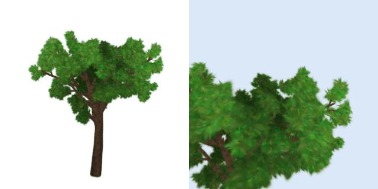

# 4DGS-experimental: wind-animated Gaussian-splat trees

[](https://colab.research.google.com/github/saranunt-0/4DGS-experimental/blob/main/notebooks/tree_wind_4dgs_demo.ipynb)

Turn a **static, object-only 3D Gaussian Splatting tree** into a **4D animation** with a swaying trunk, bending branches
and **fluttering leaves**. Export it as a **PLY sequence**, an **animated OpenUSD** splat or straight into
**Blender** / **Houdini**.



*Procedural splat tree (55k Gaussians) in 7 m/s gusty wind, rendered with the built-in CPU splatter.
Left: full tree. Right: canopy close-up showing leaf flutter. The clip loops seamlessly.*

## What's inside

| | |
|---|---|
| 📓 [`notebooks/tree_wind_4dgs_demo.ipynb`](notebooks/tree_wind_4dgs_demo.ipynb) | Colab demo: tree → object-only clean-up → skeleton → wind → preview → export (runs on CPU; GPU optional) |
| 🔬 [`docs/research_animated_3dgs.md`](docs/research_animated_3dgs.md) | State of the art (Sept 2026): animating static 3DGS, video → 4DGS, tree-specific work, Houdini 22 / Blender / USD tooling |
| 🧹 [`docs/object_only_gaussians.md`](docs/object_only_gaussians.md) | How to get object-only splats without background artifacts, with measured results |
| 📦 [`docs/export_to_dcc.md`](docs/export_to_dcc.md) | File conventions and step-by-step import into Blender, Houdini, USD tools, viewers |
| 🐍 `gs4d/` | The Python package behind the notebook |

## Quick start (Python)

```python
from gs4d import generate_tree, WindAnimation, WindParams, export_all

tree, skeleton = generate_tree()                                    # object-only procedural splat tree + its skeleton
anim = WindAnimation(tree, skeleton, WindParams(speed=6, duration=4, fps=24, loop=True))
export_all(anim, "out/tree_wind", formats=("ply_sequence", "usd", "blender"))
```

Your own capture:

```python
from gs4d import load_gaussians, estimate_up, isolate_object, extract_skeleton, WindAnimation, WindParams

scene = load_gaussians("my_tree.ply")                  # 3DGS .ply (Postshot, Polycam, Luma, KIRI, gsplat, ...) or .splat
up, how = estimate_up(scene)                           # ground-plane normal, or trunk shape + bark/leaf colours
keep, report = isolate_object(scene, up=up)            # remove ground, sky shell, background, floaters
tree = scene.subset(keep)
skeleton = extract_skeleton(tree, up=up)               # geodesic level-set skeleton + leafness
anim = WindAnimation(tree, skeleton, WindParams(speed=6, tree_height_m=8.0))
```

A **scanned point cloud** (LiDAR / photogrammetry `.ply`, `.las`, `.xyz`, or a `.zip` containing one), in one command:

```bash
python scripts/animate_pointcloud.py oak-scan.zip --out outputs/oak --tree-height-m 20 --speed 6
# -> outputs/oak/preview.mp4, preview.gif, export/ply_sequence/*.ply, export/tree_wind.usdc, export/gs4d_import_sequence.py
```

The tree is separated from the ground on a coarse fit. Its points are then fitted with oriented Gaussians
(`gs4d.pointcloud`), skeletonised and animated. A point cloud has no photos, so the splats are fitted rather
than optimised (no view-dependent shine). In Colab, pick `SOURCE = "google drive"` to load the scan straight
from your Drive.

Train an object-only tree from a phone video (GPU): see the notebook appendix or `gs4d/train.py`
(frames → pycolmap → BiRefNet masks → masked gsplat training with a random background + alpha loss).

## How the animation works

1. **Skeleton.** Either the exact branch hierarchy of the procedural tree, or one extracted from any splat tree
   (k-NN graph → geodesic distance from the trunk base → slices → connected components = joints).
2. **Wind field.** Mean flow + gust fronts travelling downwind + smooth turbulence. It can loop seamlessly.
3. **Branch dynamics.** Each joint is a damped oscillator driven by the drag torque of its whole subtree. Stiffness
   and frequency go from a slow trunk to fast twigs via a pipe-model thickness proxy. This is the same family as
   game-engine vegetation, Houdini 22's splat vegetation sims, and the oscillator prior in *Wind on Trees* (2026).
4. **Forward kinematics.** Every Gaussian's centre **and** orientation are re-posed.
5. **Leaf flutter.** A coherent noise field rotates and jitters the leaf splats. Their anisotropy turns rotation
   into the shimmer of real foliage.

## Verified

`pytest` (30 tests) covers: PLY/`.splat` round-trips in the reference layout, quaternion and covariance maths, the
CPU renderer, zero wind = identity, downwind bending, seamless loops, leaf-only flutter, skeleton extraction for
three up axes, object isolation and mask voting on synthetic captures, animated USD read-back, the COLMAP reader,
the masked-training loop (with a mock rasteriser), and **importing the PLY sequence into Blender 5.0 (headless) and
checking the per-frame instance positions**, and executing the whole notebook end-to-end in CI mode
(`GS4D_NOTEBOOK_TEST=1`). The pycolmap stage was run on 36 synthetic views (36/36 registered).

Not verified here (no GPU in the build environment): gsplat CUDA rendering and real gsplat training. That code
follows gsplat 1.5's API and its densification strategy was exercised on CPU.

## Repository layout

```
gs4d/
  gaussians.py        GaussianModel (raw 3DGS conventions)          io_ply.py      .ply / .splat read-write
  procedural_tree.py  tree grown out of Gaussians + skeleton        skeleton.py    skeleton extraction, up axis, leafness
  wind.py             wind field, oscillators, FK, leaf flutter     cleanup.py     object-only tools (isolate, mask vote, ...)
  render.py           CPU EWA splatter + gsplat path, cameras       export.py      PLY sequence, USD, NPZ, zip
  train.py            video → COLMAP → masks → masked gsplat         colmap.py      COLMAP model reader/writer
  pointcloud.py       scanned point cloud → fitted Gaussians, load_scan (zip / isolate / fit)
  synthetic.py        fake capture artifacts for demos/tests        viz.py         notebook helpers
  data/gs4d_import_sequence.py   Blender Geometry-Nodes importer (copied into every export)
notebooks/            Colab notebook (generated by scripts/build_notebook.py)
scripts/              animate_pointcloud.py (scan → animation → exports), benchmark_isolation.py, build_notebook.py
docs/                 research, object-only investigation, DCC export guide
tests/                pytest suite
```

## Development

```bash
pip install -e ".[dev]"          # + usd-core; optional: pip install bpy (Blender as a module, Python 3.11)
pytest -q
python scripts/build_notebook.py # regenerate the notebook after editing it
GS4D_NOTEBOOK_TEST=1 jupyter nbconvert --to notebook --execute notebooks/tree_wind_4dgs_demo.ipynb --output /tmp/out.ipynb
```
