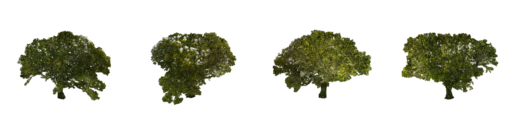

# 200-year-old oak: object-only 3DGS



`oak_3dgs_500k.ply` is a standard 3D Gaussian Splatting PLY (SH degree 0), fitted to the photogrammetry point cloud
in [`test_asset/200-year-old-oak-tree.zip`](../../test_asset/200-year-old-oak-tree.zip). It has the same license
as that scan.

| | |
|---|---|
| Splats | 500,144, object only (no ground or sky) |
| Units / axes | metres, **+Z up**, trunk axis through the origin, trunk base at z = 0 |
| Size | 25.7 × 28.0 × 19.6 m |
| Colour | the scan's baked colour, sky bleed repaired (no view-dependent shine) |
| Opens in | SuperSplat, Postshot, KIRI 3DGS Render (Blender), Houdini 22, gsplat/INRIA viewers, `gs4d.load_gaussians` |

**`oak_3dgs_render_to_splat_155k.ply`** is the same oak made the other way: 125 renders of the point cloud, then a 3DGS
trained on those images (155,537 splats, 10.6 MB, same frame). It looks sharper than the 500k direct fit from a
distance, but shows some needle-shaped splats up close. See
[`docs/render_to_splat_vs_direct.md`](../../docs/render_to_splat_vs_direct.md).

Regenerate the file, or the wind animation (PLY sequence + Blender importer, ~3 GB for 96 frames):

```bash
python scripts/animate_pointcloud.py test_asset/200-year-old-oak-tree.zip --out outputs/oak --max-gaussians 500000 --static-only
python scripts/animate_pointcloud.py test_asset/200-year-old-oak-tree.zip --out outputs/oak --max-gaussians 500000 \
    --speed 6 --gustiness 0.5 --trunk-stiffness 2 --flutter-deg 20 --direction 180
```

Animate the committed file directly:

```python
from gs4d import load_gaussians, extract_skeleton, WindAnimation, WindParams, export_all
oak = load_gaussians("assets/oak/oak_3dgs_500k.ply")
anim = WindAnimation(oak, extract_skeleton(oak, up="+z"), WindParams(speed=6, trunk_stiffness=2, leaf_flutter_deg=20))
export_all(anim, "outputs/oak_wind", formats=("ply_sequence", "blender"))
```

How it was made, and its limitations: [`docs/object_asset_workflows.md`](../../docs/object_asset_workflows.md).
