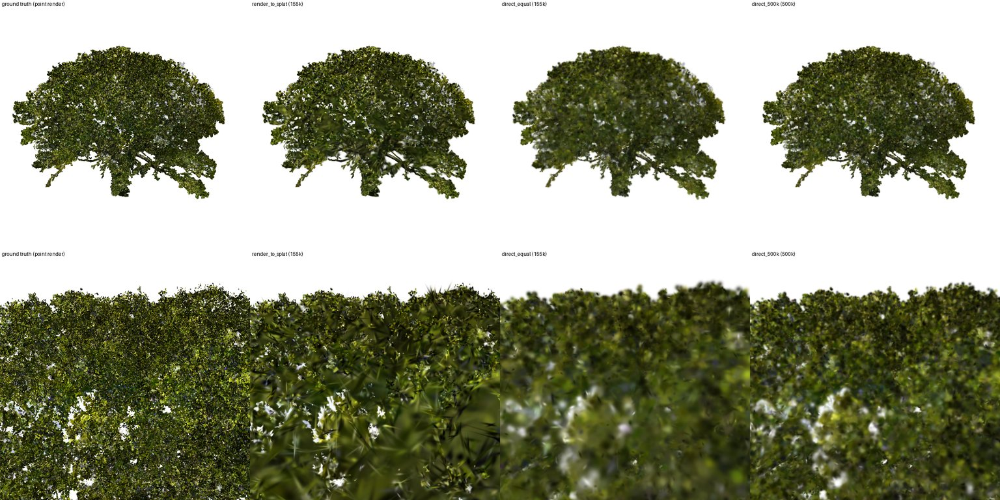
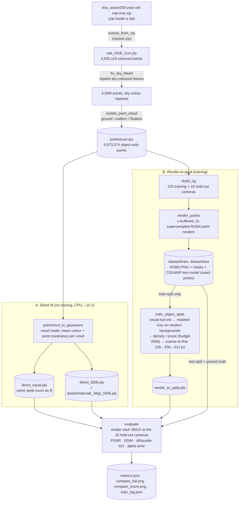
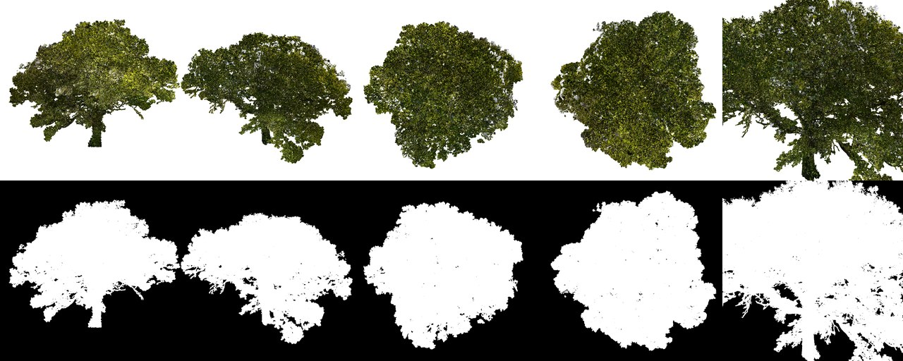
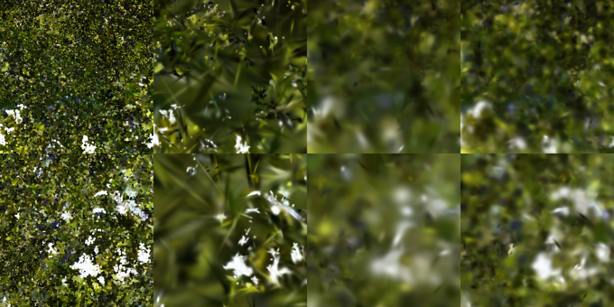

# Two ways to turn the oak scan into a 3DGS: direct fit vs render-to-splat

**Question.** We have a scanned tree as a coloured point cloud (`test_asset/200-year-old-oak-tree.zip`, 4.6M points)
and no photos. Should we:

* **A. Direct fit:** convert the points straight into Gaussians, one per cluster of points, with no training
  (what `assets/oak/oak_3dgs_500k.ply` is); or
* **B. Render-to-splat:** "photograph" the point cloud from many virtual cameras, then train a normal 3DGS on those
  images only, as if they were photos of the real tree?

B is how Houdini (GSOPs `generate_training_data`), Blender camera-array rigs and KIRI-style pipelines make splat
assets from CG content. This page shows exactly how each was built here and compares their **3DGS quality** on
views that neither method was fitted to.

**Short answer.** With the same number of splats, **render-to-splat is clearly better**: +2.1 dB PSNR and +0.11 SSIM
on 16 held-out views, better on all 16 of them. Its **155k splats even beat the 500k-splat direct fit** (+0.3 dB,
+0.025 SSIM, 14 of 16 views) in a third of the file size. The price is compute: about 4 hours of CPU training here
(a GPU should need minutes, not measured) versus about 10 seconds. Up close it shows needle-shaped splats, a classic 3DGS artefact that more
views or iterations reduce.

| Held-out views (16) | Splats | File | PSNR ↑ | SSIM ↑ | Silhouette IoU ↑ | Alpha error ↓ | Time to make |
|---|---|---|---|---|---|---|---|
| **B. Render-to-splat** | 155,537 | 10.6 MB | **21.29 dB** | **0.724** | 0.989 | **0.0081** | 3 h 48 min training (CPU) + 15 min rendering |
| A. Direct fit, same budget | 155,554 | 10.6 MB | 19.22 dB | 0.610 | 0.984 | 0.0124 | 8 s |
| A. Direct fit, 500k (`oak_3dgs_500k.ply`) | 500,144 | 34.0 MB | 20.95 dB | 0.699 | **0.990** | 0.0083 | 9 s |

*All three share the same 43 s scan clean-up (step 1-4 below); times are on 4 CPU cores.*



*Held-out views that no method was fitted to. Columns: ground truth (the point cloud rendered from that camera),
**render-to-splat 155k**, direct fit 155k, direct fit 500k. Top row: whole tree. Bottom row: crown close-up.*

---

## 1. The whole process at a glance



Everything above is one command (each stage is cached in `--out`, so an interrupted run resumes):

```bash
python scripts/render_to_splat.py test_asset/200-year-old-oak-tree.zip --out outputs/oak_distill \
    --iters 6000 --res-schedule 0:4,1000:2,2500:1 --max-gaussians 200000 --init-points 50000 \
    --align-to assets/oak/oak_3dgs_500k.ply
```

## 2. Step by step: scripts, inputs, outputs

| # | Step | Code | Input | Output | Key settings |
|---|---|---|---|---|---|
| 1 | Unzip | `gs4d/pointcloud.py` `extract_from_zip` | `200-year-old-oak-tree.zip` (61 MB, zip inside a zip) | `oak_RGB_2cm.ply` (69.5 MB, 4,635,119 points, RGB) | picks the largest point-cloud file, opens nested zips |
| 2 | Read | `read_point_cloud` | `.ply` | `PointCloud` (float64 points recentred, RGB 0-1) | survey offsets removed before float32 |
| 3 | Sky-bleed repair | `fix_sky_bleed` | 4.63M points | same points, 513k recoloured, 592 floaters removed | blue always; grey only inside foliage (≥ 20% leafy neighbours) |
| 4 | Isolate | `isolate_point_cloud` | 4.63M points, up = +Z | **`pointcloud.npz`**: 4,573,374 object points | coarse 200k fit → `isolate_object` (ground, outliers, connectivity) → keep the tree's points |
| A5 | Direct fit | `pointcloud_to_gaussians(mode="voxel")` | `pointcloud.npz` | **`direct_equal.ply`**, **`direct_500k.ply`** | voxel size solved for the budget; each splat = mean colour + 1.35× std of its voxel's points, opacity 0.95 |
| B5 | Camera rig | `gs4d/distill.py` `distill_rig` | object points | 125 train cameras + 16 test cameras | rings at −10°, 10°, 30°, 50°, 70° (16/24/24/16/8 views) + top view, at the distance where the bounding sphere fills the 45° frame; 36 closer views (0.55×) aimed at random crown points; **test views at random other angles** (12 far, 4 close) |
| B6 | "Photograph" | `render_points` | points + a camera | RGB + alpha, 512×512 (~6 s per view, 141 views ≈ 15 min) | each point is a 2.5 cm disc (≥ 1 px), z-buffer, points within 2.5 cm of the front surface averaged, rendered at 1024² and box-filtered to 512² (anti-aliased alpha) |
| B7 | Dataset | `write_dataset` | 141 renders + cameras | **`dataset/{train,test}/images/*.png`** (RGBA), `masks/*.png`, `sparse/0/{cameras,images,points3D}.txt` | standard COLMAP text model with the exact poses, so gsplat, nerfstudio, Postshot or Brush can train on it too |
| B8 | Load | `load_rendered_dataset` → `train.load_dataset` | `dataset/train` | `TrainData` (images, masks, cameras, no SfM points) | |
| B9 | Initialise | `train._init_points` → `visual_hull_points` | masks + cameras | **14,776** starting splats (300k random candidates, up to 50k kept) | a candidate is kept if it projects inside the mask in ≥ 90% of views; colour = mean pixel colour; size = 0.5 × neighbour spacing, opacity 0.1 |
| B10 | Train | `train.train_object_splat` with `torch_raster.rasterize_cpu` | `TrainData` | **`render_to_splat.ply`** | 6,000 steps, one random view per step; loss = 0.8·L1 + 0.2·(1−SSIM) on the image composited over a **random background colour** + 0.3·\|alpha − mask\|; Adam; gsplat `DefaultStrategy` densify/prune steps 500–4,200 every 100, opacity reset at 3,000, **budget 200k** (only the largest-gradient splats grow; refinement stopped at 156,798); resolution 128 px (steps 0–999) → 256 px (1,000–2,499) → 512 px (2,500+); SH degree 0 |
| 11 | Evaluate | `distill.evaluate` | the 3 models + `dataset/test` | **`metrics.json`**, `compare_full.png`, `compare_zoom.png` | every model rendered with the same rasteriser at the 16 held-out cameras, over white; PSNR and SSIM of RGB, silhouette IoU (alpha > 0.5) and mean alpha error against the point renders |

### Why these choices

* **Known poses, no COLMAP.** The cameras are ours, so their poses are exact. Running SfM on renders would only add
  error. The COLMAP text files are written anyway, so the dataset works with standard trainers.
* **RGBA renders and masked training** make the result object-only by construction. With a random background colour
  every step, empty space can't be explained by any splat, so none grow there (see
  [`object_only_gaussians.md`](object_only_gaussians.md)).
* **Visual-hull init** uses the images only (masks + cameras), not the point cloud, so B never sees the points
  directly. That keeps the comparison honest: B learns the tree from pictures alone.
* **SH degree 0.** A point cloud has one colour per point, so its renders have no view-dependent shine to learn.
* **CPU tricks** (no GPU here):
  * `gs4d/torch_raster.py` is a differentiable rasteriser written in plain PyTorch. Its forward pass matches the
    reference renderer to < 1/255.
  * Coarse-to-fine resolution makes early steps (large, overlapping splats) cheap.
  * The splat budget keeps each step to about 1 s.

  On a GPU, the same script uses gsplat's CUDA rasteriser automatically.
* **Held-out test views** are at angles and distances no training camera used. They measure how the 3DGS looks from
  a new viewpoint, which is what matters for an asset.

## 3. Results

### 3.1 What the training images look like



*5 of the 125 training "photos" (top) and their alpha masks (bottom): below the crown (−10°), 30°, 50°, from above,
and a close-up. Each is a 512×512 render of the 4.57M-point cloud. The background is transparent, so the masks come
for free and are exact.*

### 3.2 Numbers, split by view type

PSNR in dB. Higher is better, and +1 dB is a clearly visible difference.

| | 12 whole-tree views | 4 close-up views | Wins vs direct 155k | Wins vs direct 500k |
|---|---|---|---|---|
| Render-to-splat 155k | **22.79** | **16.78** | 16 / 16 | 14 / 16 |
| Direct fit 155k | 20.48 | 15.46 | – | – |
| Direct fit 500k | 22.52 | 16.27 | – | – |

The absolute PSNR is modest (~21 dB) for every method because the ground truth is a *point* render. Its per-pixel
speckle of individual 2 cm points is something no 150-500k-splat model reproduces at 512 px. The **differences**
between methods are what matter here.

### 3.3 Close-up detail



*Centre crops of the two close-up test views, enlarged 2×. Same column order.*

* **Render-to-splat** keeps the **gaps between leaves crisp**: the white holes where you see through the crown. That
  is why its alpha error is lowest. Its leaf clusters are sharp, but some splats became long **needles**. The images
  only constrain what the cameras saw, and 125 views × 6,000 steps is a short schedule, so thin, stretched splats
  that look right from the training angles survive.
* **Direct fit 155k** needs ~22 cm voxels to hit the budget, so it is visibly **blurry** and loses the gaps.
* **Direct fit 500k** has the most scan-like texture up close (it is built from the points themselves), but it is
  softer, and it needs 3.2× the splats to roughly match render-to-splat from a distance.

### 3.4 Why render-to-splat wins at equal budget

The direct fit spends its splats uniformly: one per voxel, wherever there are points. That includes the inside of the
crown, which no camera can see. Training spends them where the **image error** is: densification clones and splits
splats with large screen-space gradients (edges, gaps, contrast). It then tunes each splat's opacity, size,
orientation and colour against every view. The direct fit has one fixed opacity (0.95) and sizes from point
statistics, not from how the tree looks.

### 3.5 Training progress

Measured on 4 of the held-out views (2 far, 2 close) during training, so lower than the full 16-view numbers:

| Step | Resolution | Splats | PSNR | SSIM | Wall time |
|---|---|---|---|---|---|
| 1 | 128 px | 14,776 (visual hull) | 14.36 | 0.361 | 0 min |
| 1,000 | 128 → 256 px | 27,606 | 17.03 | 0.414 | 6 min |
| 2,500 | 256 → 512 px | 95,903 | 18.31 | 0.493 | 30 min |
| 4,000 | 512 px | 153,457 | 19.39 | 0.559 | 2 h 4 min |
| 4,200 | | 156,798 (refinement stops) | | | |
| 6,000 | 512 px | 156,798 → 155,537 after pruning | **19.69** | **0.578** | 3 h 48 min |

The curve was still rising when training stopped. Longer training would help: typical 3DGS runs use 30,000 steps.

### 3.6 Which one should you use?

| Use | When |
|---|---|
| **Direct fit** (`animate_pointcloud.py`, seconds) | Quick previews, animation work, very large scans, no GPU. When you need a *faithful* copy of the points at high splat counts |
| **Render-to-splat** (`render_to_splat.py`) | The final asset: the best look per splat, crisp silhouettes and gaps, smaller files for the web. Best on a GPU with more views and steps |
| Both | Render-to-splat initialised from a direct fit ("seeded") would start near the answer and mostly sharpen it. This is the natural next experiment, but B was kept image-only here for a fair comparison |

### 3.7 Honest limitations of this experiment

* The "photos" are renders of the same point cloud, so neither method can be better than the scan. This compares
  how well each **3DGS represents the scan**, not how close either is to the real tree.
* The CPU budget capped training at 6,000 steps, 512 px, 125 views and ~157k splats. On a GPU, 1024 px, 30k steps and
  ~1M splats are routine and should widen the gap and remove most needles.
* No LPIPS: torchvision / LPIPS weights were not installable here. PSNR, SSIM, silhouette IoU and alpha error were
  computed with the repo's own code (`gs4d.distill.evaluate`).
* One run (seed 0), no error bars. The smaller synthetic-tree smoke test showed the same ranking at equal budget
  (27.9 dB vs 25.8 dB).

## 4. Reproduce

```bash
# CPU (this machine: 4 cores, ~4 h 6 min: 15 min rendering, 3 h 48 min training)
python scripts/render_to_splat.py test_asset/200-year-old-oak-tree.zip --out outputs/oak_distill --align-to assets/oak/oak_3dgs_500k.ply
# GPU (Colab T4 or better): same command. gsplat's CUDA rasteriser is picked automatically, so you can afford more:
python scripts/render_to_splat.py test_asset/200-year-old-oak-tree.zip --out outputs/oak_distill_gpu \
    --res 1024 --iters 30000 --max-gaussians 1000000 --res-schedule 0:1 --device cuda
```

`outputs/oak_distill/dataset/train` is a plain COLMAP dataset with RGBA images, so you can also train it in
Postshot, Brush, nerfstudio (`ns-train splatfacto --data ...`) or gsplat's `simple_trainer.py`.
